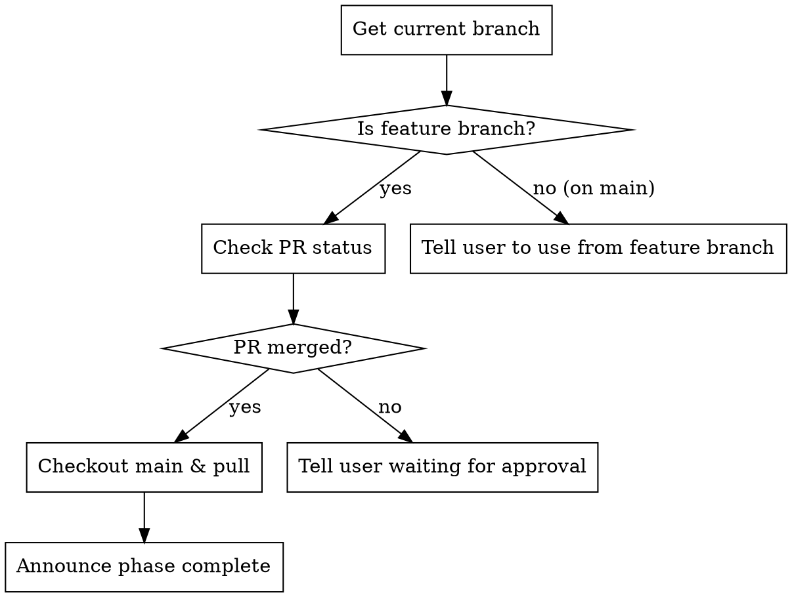

# End Plan Phase

## Overview

Finalizes a development phase after PR approval by verifying the PR was merged and returning to main branch.

## Workflow



## Steps

### Step 1: Get Current Branch

```bash
CURRENT_BRANCH=$(git branch --show-current)
echo "Current branch: $CURRENT_BRANCH"
```

**If on `main`:** Tell user this command should be run from a feature branch.

### Step 2: Check PR Status

```bash
# Get PR number and state for current branch
gh pr view --json number,state,mergedAt,headRefName
```

**Parse the response:**
- `state: "MERGED"` → PR was merged, proceed to Step 3
- `state: "OPEN"` → PR still waiting for approval
- `state: "CLOSED"` → PR was closed without merging (error state)
- No PR found → Tell user no PR exists for this branch

### Step 3: If Merged - Return to Main

```bash
git checkout main
git pull origin main
```

### Step 4: Announce Completion

**If PR was merged, display:**

```
═══════════════════════════════════════════════════════════════
PHASE COMPLETE - MERGED TO MAIN
═══════════════════════════════════════════════════════════════

Branch: <branch-name>
PR: #<number> - MERGED

Main branch is now up to date.

Ready to start next phase with /execute-next-plan
═══════════════════════════════════════════════════════════════
```

**If PR is still open, display:**

```
═══════════════════════════════════════════════════════════════
WAITING FOR PR APPROVAL
═══════════════════════════════════════════════════════════════

Branch: <branch-name>
PR: #<number> - OPEN

The PR has not been merged yet. Please:
1. Review the PR on GitHub
2. Approve and merge the PR
3. Run /end-plan-phase again

PR URL: <url>
═══════════════════════════════════════════════════════════════
```

## Error Handling

| Situation | Response |
|-----------|----------|
| On main branch | "Run this from a feature branch after PR approval" |
| No PR exists | "No PR found for branch. Create PR first with /execute-next-plan" |
| PR closed (not merged) | "PR was closed without merging. Check PR status on GitHub" |
| Network error | "Cannot reach GitHub. Check connectivity and try again" |
