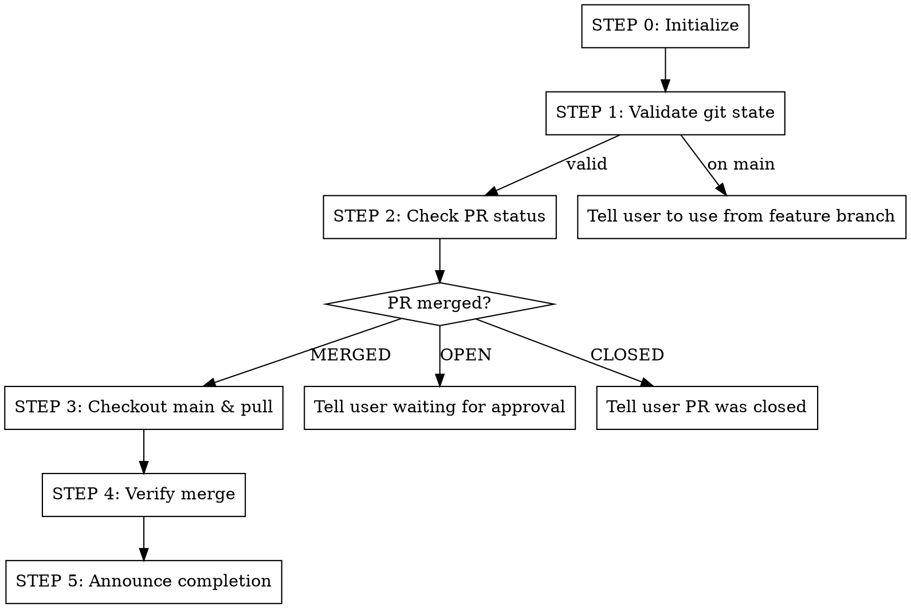

# End Plan Phase

## Overview

Finalizes a development phase after PR approval by verifying the PR was merged and returning to main branch.

## Workflow



---

## CRITICAL: MANDATORY ENFORCEMENT SYSTEM

**THIS IS NOT OPTIONAL. YOU MUST FOLLOW THIS EXACTLY.**

### STEP 0: Initialize Workflow Checklist (DO THIS FIRST!)

**IMMEDIATELY upon starting this skill, before ANY other action, you MUST:**

1. **Announce:** "I'm using the plan:end-phase skill. Initializing mandatory workflow checklist."

2. **Create task tracking using Claude's TaskCreate/TaskUpdate tools:**

> **Note:** Use `TaskCreate` to create tasks and `TaskUpdate` to change their status.

**Create tasks for all steps:**

```
TaskCreate: "STEP 1: Validate git state and branch" (activeForm: "Validating git state")
TaskCreate: "STEP 2: Check PR status" (activeForm: "Checking PR status")
TaskCreate: "STEP 3: Checkout main and pull" (activeForm: "Checking out main")
TaskCreate: "STEP 4: Verify merge in main" (activeForm: "Verifying merge")
TaskCreate: "STEP 5: Announce phase completion" (activeForm: "Announcing completion")
```

3. **RULE:** Before starting ANY step, use `TaskUpdate` to mark it `in_progress`. After completing it, mark it `completed`.

4. **RULE:** You CANNOT start a step until ALL previous steps are `completed`.

5. **RULE:** If you skip a step, you have FAILED the workflow. Start over.

---

## STEP 1: Validate Git State and Branch

**Use `TaskUpdate` to mark STEP 1 as `in_progress` before starting.**

### 1.1 Check for Uncommitted Changes

```bash
# Check for uncommitted changes BEFORE any git operations
git status --porcelain
```

**If output is NOT empty (uncommitted changes exist):**

```
═══════════════════════════════════════════════════════════════
ERROR: UNCOMMITTED CHANGES DETECTED
═══════════════════════════════════════════════════════════════

You have uncommitted changes in your working directory.
Please commit or stash your changes before running this command.

Options:
1. Commit changes: git add -A && git commit -m "message"
2. Stash changes: git stash
3. Discard changes: git checkout . (WARNING: loses all changes)

After resolving, run /plan:end-phase again.
═══════════════════════════════════════════════════════════════
```

**STOP HERE if uncommitted changes exist. Do not proceed.**

### 1.2 Get Current Branch

```bash
CURRENT_BRANCH=$(git branch --show-current)
echo "Current branch: $CURRENT_BRANCH"
```

**If on `main`:**

```
═══════════════════════════════════════════════════════════════
ERROR: ON MAIN BRANCH
═══════════════════════════════════════════════════════════════

This command should be run from a feature branch after PR approval.

Current branch: main

To end a phase, you must be on the feature branch that has a merged PR.

If you need to start a new phase, use /plan:execute-next-phase instead.
═══════════════════════════════════════════════════════════════
```

**STOP HERE if on main. Do not proceed.**

### 1.3 Verify Branch is Tracking Remote

```bash
# Check if branch has a remote tracking branch
git rev-parse --abbrev-ref --symbolic-full-name @{u} 2>/dev/null || echo "NO_UPSTREAM"
```

**If output is `NO_UPSTREAM`:**

```
═══════════════════════════════════════════════════════════════
WARNING: BRANCH NOT TRACKING REMOTE
═══════════════════════════════════════════════════════════════

Branch '$CURRENT_BRANCH' is not tracking a remote branch.

This may indicate the branch was never pushed. Attempting to check
PR status anyway, but if no PR exists, you may need to:

1. Push the branch: git push -u origin $CURRENT_BRANCH
2. Create a PR: gh pr create
3. Wait for PR to be merged
4. Run /plan:end-phase again
═══════════════════════════════════════════════════════════════
```

**Continue but note the warning.**

### 1.4 Verify Remote is Accessible

```bash
# Check if we can reach the remote
git ls-remote --exit-code origin HEAD >/dev/null 2>&1 && echo "REMOTE_OK" || echo "REMOTE_UNREACHABLE"
```

**If output is `REMOTE_UNREACHABLE`:**

```
═══════════════════════════════════════════════════════════════
ERROR: CANNOT REACH REMOTE
═══════════════════════════════════════════════════════════════

Unable to connect to the remote repository 'origin'.

Possible causes:
- Network connectivity issues
- Remote repository access revoked
- Repository URL changed

Troubleshooting:
1. Check network connection
2. Verify remote URL: git remote -v
3. Test SSH/HTTPS access to the repository
4. Contact repository administrator if access issues persist

After resolving, run /plan:end-phase again.
═══════════════════════════════════════════════════════════════
```

**STOP HERE if remote unreachable. Do not proceed.**

**Use `TaskUpdate` to mark STEP 1 as `completed`.**

---

## STEP 2: Check PR Status

**Use `TaskUpdate` to mark STEP 2 as `in_progress` before starting.**

```bash
# Get PR number, state, URL, and merge info for current branch
gh pr view --json number,state,mergedAt,headRefName,url,mergeCommit
```

**Parse the response and handle each state:**

### State: MERGED

PR was successfully merged. Store the following for later use:
- `number`: PR number
- `url`: PR URL
- `mergeCommit.oid`: The merge commit SHA (for verification in STEP 4)

**Proceed to STEP 3.**

### State: OPEN

PR is still waiting for approval.

```
═══════════════════════════════════════════════════════════════
WAITING FOR PR APPROVAL
═══════════════════════════════════════════════════════════════

Branch: <branch-name>
PR: #<number> - OPEN
PR URL: <url>

The PR has not been merged yet. Please:

1. Review the PR on GitHub: <url>
2. Address any review comments
3. Get approval from reviewers
4. Merge the PR
5. Run /plan:end-phase again

If there are review comments to address, use:
/plan:pr-review-process-comments
═══════════════════════════════════════════════════════════════
```

**STOP HERE. Do not proceed.**

### State: CLOSED

PR was closed WITHOUT being merged. This requires user intervention.

```
═══════════════════════════════════════════════════════════════
ERROR: PR CLOSED WITHOUT MERGE
═══════════════════════════════════════════════════════════════

Branch: <branch-name>
PR: #<number> - CLOSED (not merged)
PR URL: <url>

The PR was closed without being merged. This typically happens when:

1. The PR was manually closed by a reviewer
2. The changes were rejected
3. The PR was superseded by another PR
4. The PR was closed by mistake

Options:

A) If closed by mistake - Reopen the PR:
   gh pr reopen <number>
   Then get it reviewed and merged.

B) If changes were rejected - Review feedback:
   gh pr view <number> --comments
   Address feedback, push changes, then reopen.

C) If superseded - Check which PR replaced this one:
   gh pr list --state merged --head <branch-name>
   If another PR merged these changes, you can delete this branch.

D) If work should be abandoned - Clean up:
   git checkout main
   git branch -D <branch-name>
   Start fresh with /plan:execute-next-phase

After resolving, run /plan:end-phase again (if reopened and merged)
or proceed with the appropriate cleanup option.
═══════════════════════════════════════════════════════════════
```

**STOP HERE. Do not proceed.**

### No PR Found

No PR exists for this branch.

```
═══════════════════════════════════════════════════════════════
ERROR: NO PR FOUND
═══════════════════════════════════════════════════════════════

Branch: <branch-name>
No pull request found for this branch.

This command is used to finalize a phase AFTER a PR has been merged.

To complete this phase:
1. Push your branch if not pushed: git push -u origin <branch-name>
2. Create a PR: gh pr create
3. Get the PR reviewed and merged
4. Run /plan:end-phase again

If you're in the middle of development, use /plan:execute-next-phase
to continue with the proper workflow.
═══════════════════════════════════════════════════════════════
```

**STOP HERE. Do not proceed.**

**Use `TaskUpdate` to mark STEP 2 as `completed`.**

---

## STEP 3: Checkout Main and Pull

**Use `TaskUpdate` to mark STEP 3 as `in_progress` before starting.**

### 3.1 Checkout Main Branch

```bash
git checkout main
```

**If checkout fails:**

```
═══════════════════════════════════════════════════════════════
ERROR: CHECKOUT FAILED
═══════════════════════════════════════════════════════════════

Failed to checkout main branch.

Common causes and solutions:

1. Uncommitted changes blocking checkout:
   - Run: git stash
   - Then retry: git checkout main
   - Later: git stash pop (to restore changes)

2. Merge conflicts from previous operation:
   - Run: git status
   - Resolve conflicts or: git merge --abort
   - Then retry

3. File permission issues:
   - Check file permissions in .git directory
   - Ensure no other process has files locked

4. Corrupted git state:
   - Run: git fsck
   - If issues found: git gc --prune=now

After resolving, run /plan:end-phase again.
═══════════════════════════════════════════════════════════════
```

**STOP HERE if checkout fails. Do not proceed.**

### 3.2 Pull Latest Changes

```bash
git pull origin main
```

**If pull fails:**

```
═══════════════════════════════════════════════════════════════
ERROR: PULL FAILED
═══════════════════════════════════════════════════════════════

Failed to pull latest changes from origin/main.

Common causes and solutions:

1. Network timeout:
   - Check internet connection
   - Retry: git pull origin main

2. Authentication failure:
   - Verify credentials: gh auth status
   - Re-authenticate: gh auth login

3. Merge conflicts:
   - Run: git status
   - Resolve conflicts manually
   - Run: git add . && git commit
   - Or abort: git merge --abort

4. Remote ref issues:
   - Fetch first: git fetch origin
   - Then: git reset --hard origin/main
   (WARNING: This discards local main changes)

After resolving, run /plan:end-phase again.
═══════════════════════════════════════════════════════════════
```

**STOP HERE if pull fails. Do not proceed.**

**Use `TaskUpdate` to mark STEP 3 as `completed`.**

---

## STEP 4: Verify Merge in Main

**Use `TaskUpdate` to mark STEP 4 as `in_progress` before starting.**

Verify that the PR merge commit is actually in main branch.

```bash
# Check if the merge commit exists in main
# Use the mergeCommit.oid from STEP 2
git branch --contains <merge-commit-sha> | grep -q main && echo "VERIFIED" || echo "NOT_FOUND"
```

**Alternative verification (if merge commit SHA not available):**

```bash
# Check if the PR's head commit is in main's history
git log --oneline main | head -20
# Look for the PR merge message or the feature branch commits
```

**If NOT_FOUND:**

```
═══════════════════════════════════════════════════════════════
WARNING: MERGE COMMIT NOT FOUND IN MAIN
═══════════════════════════════════════════════════════════════

The merge commit from PR #<number> was not found in main branch.

This could indicate:
1. The PR was squash-merged (commit SHA changed)
2. Main branch was force-pushed after merge
3. Sync issue between local and remote

Verifying via PR API that merge is complete...

If GitHub confirms the PR is merged, this is likely a squash merge
and the verification is considered successful.
═══════════════════════════════════════════════════════════════
```

**If verification fails completely:**

```bash
# Double-check PR state directly
gh pr view <number> --json state,mergedAt
```

**If PR shows merged in API, consider verification passed.**

**Use `TaskUpdate` to mark STEP 4 as `completed`.**

---

## STEP 5: Announce Phase Completion

**Use `TaskUpdate` to mark STEP 5 as `in_progress` before starting.**

**Display completion message with PR URL:**

```
═══════════════════════════════════════════════════════════════
PHASE COMPLETE - MERGED TO MAIN
═══════════════════════════════════════════════════════════════

Branch: <branch-name>
PR: #<number> - MERGED
PR URL: <url>

WORKFLOW STEPS COMPLETED:
[x] STEP 1: Validated git state and branch
[x] STEP 2: Verified PR status (MERGED)
[x] STEP 3: Checked out main and pulled latest
[x] STEP 4: Verified merge commit in main
[x] STEP 5: Phase completion announced

Main branch is now up to date with all changes from this phase.

Ready to start next phase with /plan:execute-next-phase
═══════════════════════════════════════════════════════════════
```

**Use `TaskUpdate` to mark STEP 5 as `completed`.**

---

## Error Recovery Guide

### Git State Errors

| Error | Recovery Steps |
|-------|----------------|
| Uncommitted changes | `git stash` or `git commit` before retrying |
| Checkout fails | Check `git status`, resolve conflicts, retry |
| Pull fails - network | Check connectivity, retry command |
| Pull fails - auth | Run `gh auth login` to re-authenticate |
| Pull fails - conflicts | Resolve conflicts manually or `git merge --abort` |

### Remote/Network Errors

| Error | Recovery Steps |
|-------|----------------|
| Cannot reach remote | Check network, verify `git remote -v` URL |
| Timeout | Wait and retry; check for large objects blocking |
| SSH key issues | Run `ssh -T git@github.com` to test; re-add keys if needed |
| HTTPS auth failure | Run `gh auth login` or check credential manager |

### PR State Errors

| Error | Recovery Steps |
|-------|----------------|
| PR still OPEN | Wait for approval/merge, address review comments |
| PR CLOSED (not merged) | Reopen with `gh pr reopen` or start new PR |
| No PR found | Create PR with `gh pr create` first |
| PR shows merged but commit not found | Likely squash merge; verify via `gh pr view` |

### Recovery Commands Quick Reference

```bash
# Stash changes temporarily
git stash

# Restore stashed changes
git stash pop

# Abort a failed merge
git merge --abort

# Re-authenticate with GitHub
gh auth login

# Check PR status directly
gh pr view --json state,mergedAt,url

# Force sync with remote (CAUTION: loses local changes)
git fetch origin && git reset --hard origin/main

# Check git repository integrity
git fsck

# Clean up git objects
git gc --prune=now
```

---

## Self-Check Questions

Before marking a step complete, ask yourself:

| Step | Self-Check Question |
|------|---------------------|
| 0 | Did I announce skill usage and create all task items? |
| 1 | Did I verify clean working directory, correct branch, and remote access? |
| 2 | Did I check PR status and confirm it shows MERGED? |
| 3 | Did I successfully checkout main and pull latest? |
| 4 | Did I verify the merge commit exists in main? |
| 5 | Did I display the completion message with PR URL? |

**If ANY answer is "no", you have not completed that step.**
