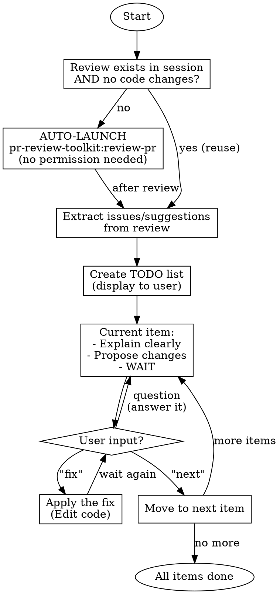

# PR Review Start-Review

## Overview

Interactive walkthrough of PR review feedback. Creates a TODO list from review issues/suggestions, then discusses each item one-by-one with the user before any code changes.

**Core principle:** User controls the pace. No batching. No auto-fixing.

**Announce at start:** "I'm using pr-review-toolkit:start-review for an interactive review walkthrough."

---

## The Iron Rule

```
NEVER apply code changes unless user explicitly says "fix"
NEVER move to next item unless user explicitly says "next"
```

**No exceptions:**
- User understanding ≠ permission to fix
- User agreement ≠ permission to fix
- Obvious fix ≠ permission to fix
- "Makes sense" ≠ permission to fix
- "Go ahead" ≠ permission to fix
- "Sure" ≠ permission to fix
- "Yes" ≠ permission to fix

**Only the literal word "fix" means fix.**

---

## Workflow



---

## Step 1: Get Review Data

### 1.1 Check for Existing Review

**Auto-launch rule:** If `pr-review-toolkit:review-pr` was NOT run in current session, OR if codebase was modified since last review:

> "Running pr-review-toolkit:review-pr to get fresh review data..."

Then **automatically invoke** `/pr-review-toolkit:review-pr`. Do NOT ask for permission - just run it.

**Skip auto-launch only when BOTH conditions are true:**
1. `pr-review-toolkit:review-pr` was already run in this session, AND
2. No code modifications were made since that review

### 1.2 Extract Issues and Suggestions

From the review output, extract:
- **Issues**: Problems that need fixing (bugs, missing validation, etc.)
- **Suggestions**: Optional improvements (refactoring, naming, style)

---

## Step 2: Create TODO List

Display a numbered TODO list:

```
## PR Review TODO

### Issues (must fix)
- [ ] #1: Missing null check in getUserData() - line 45
- [ ] #2: SQL injection vulnerability - line 78

### Suggestions (optional)
- [ ] #3: Consider renaming 'x' to 'userData' - line 22
- [ ] #4: Add loading state for better UX - line 100

Starting with item #1...
```

---

## Step 3: Walk Through Each Item

For EACH item, do exactly this:

### 3.1 Explain the Issue

```
## Item #1: Missing null check in getUserData()

**Location:** src/api/users.ts:45

**The problem:**
The function accesses `user.name` without checking if `user` is null.
If the database returns no user, this will throw a TypeError and crash.

**Why it matters:**
- Runtime crashes for invalid user IDs
- No graceful error handling for callers
- Could expose stack traces in production

**Proposed fix:**
```ts
// Before (line 45):
return user.name;

// After:
if (!user) {
  return null; // or throw new Error('User not found')
}
return user.name;
```

**Your options:**
- Say **"fix"** to apply this change
- Say **"next"** to skip and move on
- Ask questions if anything is unclear
```

### 3.2 WAIT

**STOP HERE.** Do not proceed until user responds.

---

## Red Flags - STOP Immediately

If you catch yourself thinking:
- "The user clearly wants this fixed" → STOP. Wait for "fix".
- "This is obvious, I'll just apply it" → STOP. Wait for "fix".
- "Let me show all items at once for efficiency" → STOP. One at a time.
- "They said 'makes sense' so I'll fix it" → STOP. "Makes sense" ≠ "fix".
- "I'll batch the simple ones together" → STOP. One at a time.

**All of these mean: Wait for explicit user command.**

---

## User Commands

| Command | Action |
|---------|--------|
| `fix` | Apply the proposed code change for current item |
| `next` | Skip current item, move to next |
| Questions | Answer, then continue waiting |
| `fix all` | Apply fixes to ALL remaining items (user explicitly requests batch) |
| `skip all` | Mark all remaining as skipped, end walkthrough |

---

## After "fix" Command

1. Apply the code change using Edit tool
2. Confirm: "Fixed. Item #1 complete."
3. **WAIT** - do not auto-advance to next item
4. User says "next" → move to next item

---

## After "next" Command

1. Mark item as skipped
2. Move to next item
3. Explain that item
4. **WAIT**

---

## Completion

When all items are done:

```
## Walkthrough Complete

### Fixed (2)
- #1: Missing null check
- #3: Renamed variable

### Skipped (2)
- #2: SQL injection - skipped by user
- #4: Loading state - skipped by user

Would you like to commit these changes?
```

---

## Common Mistakes

| Mistake | Why It's Wrong | Correct Behavior |
|---------|----------------|------------------|
| Batching items | User loses control | One item at a time |
| Auto-fixing after explanation | No explicit permission | Wait for "fix" |
| Moving on after user question | User didn't say "next" | Answer, then wait |
| Interpreting agreement as "fix" | "Makes sense" ≠ "fix" | Wait for literal "fix" |
| Showing all items with fixes | User overwhelmed | One at a time |

---

## Quick Reference

```
1. Get/verify review data exists
2. Create numbered TODO list
3. For each item:
   a. Explain clearly
   b. Propose code change
   c. WAIT for user command
   d. "fix" → apply change, WAIT
   e. "next" → move on
4. Summarize at end
```
